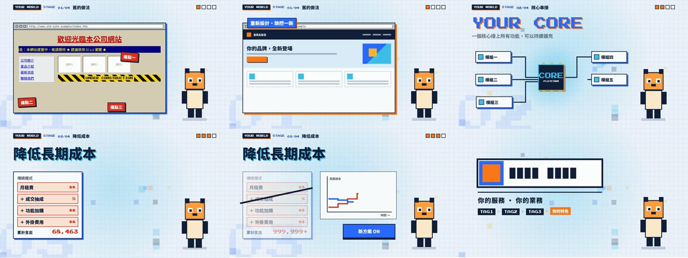

- 範例影片
https://youtu.be/7YiMerqztfY?si=iPVKVhABVhqbXlxK

# pixel-brand-video

**用 Claude Code 做 8-bit 像素風品牌短影片：畫面、配樂、音效、授權紀錄一次完成。**
A [Claude Code](https://claude.com/claude-code) skill for making 8-bit pixel-style brand videos — visuals (HyperFrames), music + SFX mixing (FFmpeg) and a license log.



## 這是什麼
一個 Claude Code **Skill**（一份寫好流程的說明 + 範本 + 腳本）。裝好之後，你只要對 Claude 說主題與重點，它就會：

1. 用 [HyperFrames](https://hyperframes.heygen.com)（HTML → MP4）把 30 秒像素風範本改成你的品牌影片
2. 從 [Mixkit](https://mixkit.co)（免費授權）挑 BGM 與音效、對拍、混音、母帶
3. 產生 `LICENSES.md` 素材授權紀錄，並做自動 QA（長度、響度、峰值、結尾淡出）

## 內容
```
pixel-brand-video/
├── SKILL.md                      # 給 Claude 的完整流程
├── assets/
│   ├── template/index.html       # 30 秒 16:9 範本（搜尋 EDIT: 改字改色）
│   ├── placeholders/             # 佔位用 Logo / 吉祥物 / 像素化 Logo
│   └── audio-pipeline/build_mix.py   # 音效 cue sheet + 混音腳本 → 產生 ffmpeg 指令
├── scripts/
│   ├── fetch_mixkit.py           # 列出／下載 Mixkit 音樂與音效
│   ├── estimate_bpm.py           # 估 BPM、第一拍、找 drop
│   └── pixelate_logo.py          # Logo → 三段像素版（結尾 8-bit 收尾用）
└── references/                   # 授權說明、混音筆記、授權紀錄範本
```

## 需求
- [Claude Code](https://claude.com/claude-code)
- Node.js 22 以上、[FFmpeg](https://ffmpeg.org)、Python 3（`pip install pillow numpy`）
- 建議同時安裝 HyperFrames 的 skill（`npx hyperframes skills`）

## 安裝
把 `pixel-brand-video` 資料夾複製到 Claude Code 的 skills 目錄，重開 Claude Code：

| 範圍 | 位置 |
|---|---|
| 全部專案可用（個人） | `~/.claude/skills/pixel-brand-video/`（Windows：`C:\Users\<你>\.claude\skills\pixel-brand-video\`） |
| 只給某個專案 | `<專案>/.claude/skills/pixel-brand-video/` |

```bash
git clone https://github.com/thedes13/pixel-brand-video.git
cp -r pixel-brand-video/pixel-brand-video ~/.claude/skills/
```

## 使用
直接對 Claude 說需求，例如：

> 用 pixel-brand-video 幫我做一支 30 秒影片。品牌「XX 科技」，Logo 在 `logo.png`，主題是「電商網站改版」，三個重點：速度、SEO、金流串接。要配樂和音效，直接做完不用問我。

不想提供吉祥物就說「不要吉祥物」；想換色就給它 3～5 個品牌色。

## 授權（重要）
- **本 repo 的程式碼、範本與佔位圖：MIT License**（見 [LICENSE](LICENSE)）。
- **repo 不含任何音樂或音效檔。** 音樂與音效由你自己用 `scripts/fetch_mixkit.py` 從 Mixkit 下載，受 [Mixkit 授權](https://mixkit.co/license/)約束：商業可用、不需署名；BGM 不可用於電視／廣播、遊戲，不可登記 Content ID；音效不可單獨轉散布。細節見 [`references/licensing.md`](pixel-brand-video/references/licensing.md)。
- 你用範本做出的影片，畫面內容與品牌素材歸你；請自行確認你使用的 Logo、字型、圖片都有合法授權。
- 授權整理只是使用者備忘，不是法律意見；Mixkit 條款可能更新，請以官網為準。

## 已知限制
- 範本是 16:9、30 秒；9:16 或其他長度要調整版面與時間軸（Claude 可以幫你改）。
- Claude 沒辦法「聽」成品，混音品質是靠響度、峰值、頻譜與畫面對位檢查；發布前請自己戴耳機聽一遍。

由益盛科技（[des13.com](https://des13.com)）整理分享。
